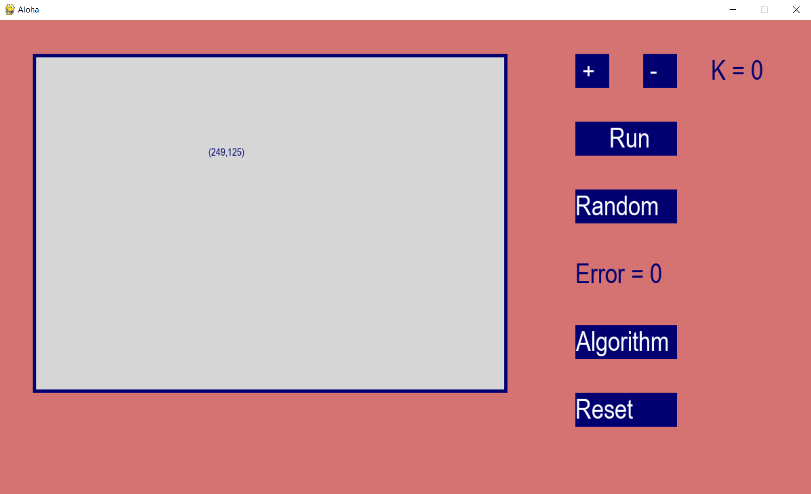

# Clustering points game

Import packages, lib

```
pip install virtualenv
python -m virtualenv pygame_clustering

cd pygame_clustering
scripts\activate 

pip install -r requirements.txt

py predict_point_pygame.py
```

## Home Screen



## 1. Create points that you want to cluster

Click into gray rectangle area


## 2. Cluster using K-means Clustering alogorithm without library

Click choose K clusters, then press the **Random** button to show any K points, and press **Run** to run algorithm

> Step 1
> 

> Step 2
> 

## 2. Cluster using K-means Clustering alogorithm built-in Sklearn

> Press choose K clusters, then click **Algorithm** button
> 

# Reference

- DungLai AI basic Course
